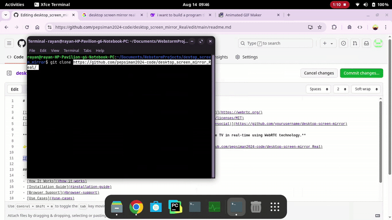

# Desktop Screen Mirror: Cross-Platform Screen Sharing via WebRTC 🔄🖥️📱

[](https://webrtc.org/)
[](https://opensource.org/licenses/MIT)
[](https://github.com/yourusername/desktop-screen-mirror)

**Mirror any desktop screen (Windows, macOS, Linux) to mobile devices (iOS, Android) and Apple TV in real-time using WebRTC technology.**

👉 **Try it now**:  | [GitHub Repository](https://github.com/pepsiman2024-code/desktop-screen-mirror_Real)



## Table of Contents
- [Key Features](#key-features)
- [How It Works](#how-it-works)
- [Installation Guide](#installation-guide)
- [Browser Support](#browser-support)
- [Use Cases](#use-cases)
- [Contributing](#contributing)
- [License](#license)
- [Support](#support)
- [About the Developer](#about-the-developer)

## Key Features ✨
- **Real-time screen mirroring** with low latency
- **Cross-platform support** (Windows/macOS/Linux → iOS/Android/Apple TV)
- **No installation required** for viewers
- **Dark/Light mode** toggle
- **Secure P2P connection** via WebRTC
- **Responsive design** for all devices

## How It Works ⚙️
1. **Broadcaster** (Desktop):
   - Visit `/broadcast.html`
   - Click "Share Screen" button
2. **Viewer** (Mobile/Tablet/TV):
   - Visit `/Viewer.html`
   - Watch the mirrored screen in real-time

```mermaid
graph LR
A[Desktop Browser] -->|WebRTC Stream| B[Signaling Server]
B -->|WebRTC Stream| C[Mobile Device]
