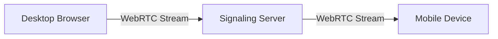

# Desktop Screen Mirror: Cross-Platform Screen Sharing via WebRTC 🔄🖥️📱

**Mirror any desktop screen (Windows, macOS, Linux) to mobile devices (iOS, Android) and Apple TV in real-time using WebRTC technology.**

👉 **Try it now**:  | [GitHub Repository](https://github.com/pepsiman2024-code/desktop-screen-mirror_Real)

## Table of Contents

- [Key Features](#key-features)
- [How It Works](#how-it-works)
- [Installation Guide](#installation-guide)
- [Browser Support](#browser-support)
- [Use Cases](#use-cases)
- [Contributing](#contributing)
- [License](#license)
- [Support](#support)
- [About the Developer](#about-the-developer)
- 
# Donation
My Public Address to Receive 0.001 BTC: bc1qj99mrehat494aqtnqy4s9gst4rwpyce7w59pkm

Pay me via Trust Wallet: https://link.trustwallet.com/send?address=bc1qj99mrehat494aqtnqy4s9gst4rwpyce7w59pkm&amount=0.001&asset=c0&value=100000

## Key Features ✨
- **Real-time screen mirroring** with low latency
- **Cross-platform support** (Windows/macOS/Linux → iOS/Android/Apple TV)
- **No installation required** for viewers
- **Dark/Light mode** toggle
- **Secure P2P connection** via WebRTC
- **Responsive design** for all devices

## How It Works ⚙️
1. **Broadcaster** (Desktop):
   - Visit `/broadcast.html`
   - Click "Share Screen" button
2. **Viewer** (Mobile/Tablet/TV):
   - Visit `/Viewer.html`
   - Watch the mirrored screen in real-time

## Installation Guide 🚀
### Clone repository
**git clone [https://github.com/pepsiman2024-code/DesktopScreenMirrorReal.git](https://github.com/pepsiman2024-code/DesktopScreenMirrorReal.git)**

# Install dependencies
npm install

# Start server
npm start

### Access at http://localhost:8080

## Browser Support 🌐
Browser	Desktop	Mobile
Chrome	   ✅	     ✅
Firefox	   ✅	     ✅
Safari	   ✅	     ✅
Edge	      ✅	     ✅
Samsung Internet	❌	✅

## Use Cases 💡

Presentations: Share your screen during meetings

Remote Assistance: Help family members with tech issues

Education: Teachers demonstrate concepts to students

Entertainment: Mirror games to larger screens

Accessibility: View desktop content on mobile devices

License 📄
This project is licensed under the MIT License - see the [License File]LICENSE.md file for details.

## About The Developer
I'm a developer from Iran passionate about creating open-source tools. This project is part of my journey to contribute to the global tech community and eventually immigrate to Canada.

"This project represents the power of WebRTC to connect people across devices and borders."
Notice: Don't block my account Because of this

🌐 Connect with me:
[GitHub]https://github.com/pepsiman2024-code/desktop_screen_mirror_Real/|
[Email]mailto:rayanesmaeelzadeh60@gmail.com
